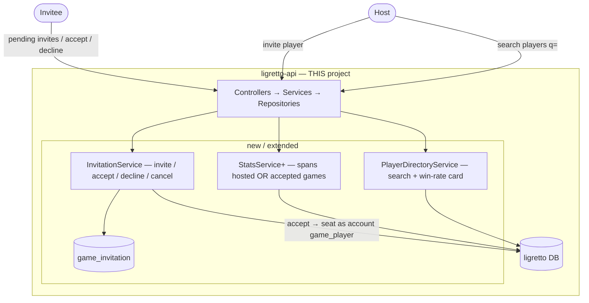

# System Context — 002-player-invites-and-stats

**Generated:** 2026-07-18T23:18:46Z

Extends intent 001's architecture (same auth platform, same `ligretto-web` + `ligretto-mobile` +
`ligretto-api` + DB). No new external systems — this is a **delta** on the existing app: a player
directory (search), an invitation flow, and cross-user stats/history. Everything stays server-side and
caller-scoped.

## Delta diagram

## Boundaries

- **In scope (built here):** a player **search** read model, a `game_invitation` domain (invite →
  pending → accept/decline/cancel), and **cross-user** stats/history — all in `ligretto-api` + the web
  (and, optionally, mobile) clients. No change to auth or to the scoring engine.
- **Reused, unchanged:** the auth platform; identity is still the JWT `sub`; the app's `player`,
  `game`, `game_player`, `round`, `round_score` tables (from 001). Accepted invitees are seated using the
  EXISTING `game_player` kind `account` (player_id set) — no new seat type.
- **Privacy boundary:** email exists on `player` (from the token) but is a **search key only** — it is
  never returned by any endpoint and never rendered.

## Data model (delta)

| Table | Change |
|---|---|
| `game_invitation` (**new**) | `id`, `game_id → game`, `inviter_player_id → player`, `invitee_player_id → player`, `status` [pending\|accepted\|declined\|cancelled], `created_at`, `responded_at?`. Unique **(game_id, invitee_player_id)** among non-terminal states (no duplicate pending). |
| `game_player` (reuse) | On accept, insert a `kind='account'` seat with `player_id = invitee`. No schema change. |
| `player` (reuse) | `display_name` may be blank → callers derive the email local-part for display. `icon_*` (intent-035 profile) shown on the card. |

## New / extended endpoints (`/api/v1`)

| Endpoint | Who | Purpose |
|---|---|---|
| `GET /players/search?q=` | any signed-in | Search Ligretto players by name/email (min 2 chars, capped). Returns id + display_name (email-prefix fallback) + icon + win_rate. **No email.** |
| `POST /games/:id/invitations` | host | Invite a found player → pending (no dup; existing players only). |
| `GET /games/:id/invitations` | host | Pending/accepted/declined for the host's game. |
| `DELETE /games/:id/invitations/:iid` | host | Cancel a pending invite. |
| `GET /invitations` | invitee | My pending invitations (host + game name; no scores). |
| `POST /invitations/:iid/accept` | invitee | Seat me as a linked account-player; stats/history now count. |
| `POST /invitations/:iid/decline` | invitee | Close the invitation; not seated. |
| `GET /history`, `GET /stats/me` (extend) | player | Now span games the player **hosted OR accepted**. |
| `GET /events` (**SSE**) | any signed-in | Authenticated Server-Sent Events stream; pushes the caller's OWN `invitation.created` events for the live in-app toast/badge (unit 010). |

## Cross-cutting

- **AuthZ / isolation (extends 001 NFR-3):** host-only mutation of a game's invites (else 404); an invitee
  may read/act on **their own** invitations only; a **pending** invitee can see the invitation metadata but
  **not** the game's scores until they accept.
- **Consent / integrity:** a player's record changes only for games they hosted or **accepted**; no stub
  players; no write to another user's data without their acceptance.
- **i18n:** EN + NL for the invite dialog, pending-invites list, player card, and invite toast.
- **Real-time (unit 010):** an **in-process** per-user pub/sub feeds the `/events` SSE stream — no extra
  infra, fits the single-instance backend; the stream is authenticated (Bearer via a fetch-stream, not
  token-in-URL) and is a live convenience over the authoritative pending list. On invite, an **away**
  email + Expo mobile push are sent **best-effort / non-blocking** via the platform `notification-api`
  (new EN+NL "you've been invited" template) — a failure never blocks the invite (ADR-036).
- **Performance:** search debounced + capped; win-rate computed server-side and bounded (aggregate/cache,
  not a per-keystroke recompute).
